# Mohamed El-Seady — Portfolio

**Live site:** <https://mandela95.github.io/Portfolio/>

A fully responsive, bilingual portfolio for a Front-End and React Native engineer with 5+ years of
hands-on experience across web and mobile.

Built with zero runtime dependencies — no framework, no bundler, no build step. Just HTML, CSS, and
vanilla JavaScript.

## Lighthouse

Measured locally, desktop preset:

| Page                   | Performance | Accessibility | Best Practices | SEO |
| ---------------------- | ----------- | ------------- | -------------- | --- |
| **Portfolio**          | 100         | 100           | 100            | 100 |
| **Class A case study** | 98          | 100           | 100            | 100 |

On the throttled mobile preset performance sits at 90–95 (LCP is hero text over simulated slow 4G),
which is why CI asserts a floor of 85 rather than the desktop figure — the accessibility, best
practices, and SEO categories are asserted at a perfect 100. Total page weight is **646 KB**, and
the YouTube embeds add nothing until someone presses play. See
[`.github/lighthouserc.json`](.github/lighthouserc.json).

---

## Features

| Feature                    | Detail                                                                                             |
| -------------------------- | -------------------------------------------------------------------------------------------------- |
| 🌐 **Bilingual (EN / AR)** | Full localization with real RTL support, including direction flip and an Arabic-specific typeface  |
| 🌓 **Dark / Light theme**  | Persisted to `localStorage`, applied via CSS custom properties                                     |
| 📱 **Responsive**          | Mobile-first layout, tested from 320px up                                                          |
| ♿ **Accessible**          | Semantic landmarks, skip link, ARIA states, focus-trapped dialog, `prefers-reduced-motion` support |
| ⚡ **Fast**                | WebP imagery, non-blocking fonts and icons, `IntersectionObserver` instead of scroll handlers      |
| 🔍 **SEO-ready**           | Canonical URL, Open Graph, Twitter cards, JSON-LD `Person` schema, sitemap, robots.txt             |
| 🧭 **Career timeline**     | Roles, stack, and quantified accomplishments                                                       |
| 🎯 **6 featured projects** | Filter by technology plus free-text search, each with Role / Challenge / Outcome                   |
| 📝 **Case study**          | A dedicated page on Class A: research, competitor gaps, architecture, and outcome                  |
| 🎬 **Video, cheaply**      | YouTube embeds use a click-to-load facade — no Google requests or cookies until play is pressed    |
| 💬 **Recommendations**     | Three verified LinkedIn recommendations from former teammates                                      |
| 📊 **GitHub overview**     | Repo/follower counts and language breakdown, fetched live from the GitHub REST API                 |
| ✉️ **Contact form**        | EmailJS-backed, with honeypot spam protection and a `mailto:` fallback                             |

---

## Running it locally

No build step and no dependencies are required to view the site — but a local server is needed,
because the page fetches `manifest.webmanifest` and the i18n scripts, which browsers block over
`file://`.

### Option 1 — npm (recommended, auto-reloads on save)

```bash
npm install   # one time, installs the dev server
npm run dev
```

This opens <http://localhost:3000> and reloads the page automatically whenever you save any file.

### Option 2 — no install

```bash
npx --yes live-server --port=3000
```

### Option 3 — Python (no live reload; refresh manually)

```bash
python3 -m http.server 3000
```

Then open <http://localhost:3000>.

### Other scripts

```bash
npm run format        # format HTML / CSS / JS with Prettier
npm run format:check  # verify formatting without writing (used in CI)
npm run lighthouse    # run a Lighthouse audit against the local server
```

---

## Project layout

```text
.
├── index.html              # Portfolio page — static markup (kept static for SEO)
├── class-a.html            # Class A case study — shares style.css and main.js
├── style.css               # All styles, CSS custom properties for theming
├── normalize.css           # Cross-browser baseline
├── main.js                 # Theme, i18n, nav, reveals, filtering, form, dialog
├── i18n/
│   ├── en.js               # English strings
│   └── ar.js               # Arabic strings (mirrors en.js key-for-key)
├── Images/                 # WebP for display, PNG for icons and social preview
│   └── readme/             # Screenshots used by this file only
├── manifest.webmanifest    # PWA metadata
├── sitemap.xml
└── robots.txt
```

### Editing content

Text on the page is driven by `data-i18n` attributes resolved against `i18n/en.js` and `i18n/ar.js`.
Changing a string in `index.html` alone will not stick — the i18n pass overwrites it on load. Update
the matching key in **both** language files.

Adding a project means three edits: a `.project-card` block in `index.html`, plus a `projects.<key>`
entry in each language file.

`main.js` is shared by both pages, so every DOM lookup in it is guarded — a page that omits a
section simply skips that behaviour.

---

## Deployment

Pushing to `main` publishes to GitHub Pages. There is nothing to build.

---

## Screenshots

### Desktop

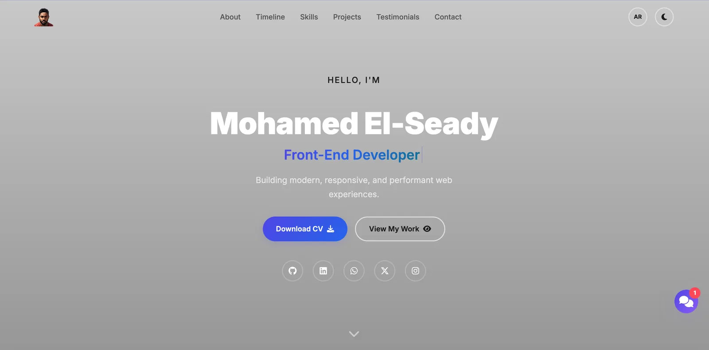

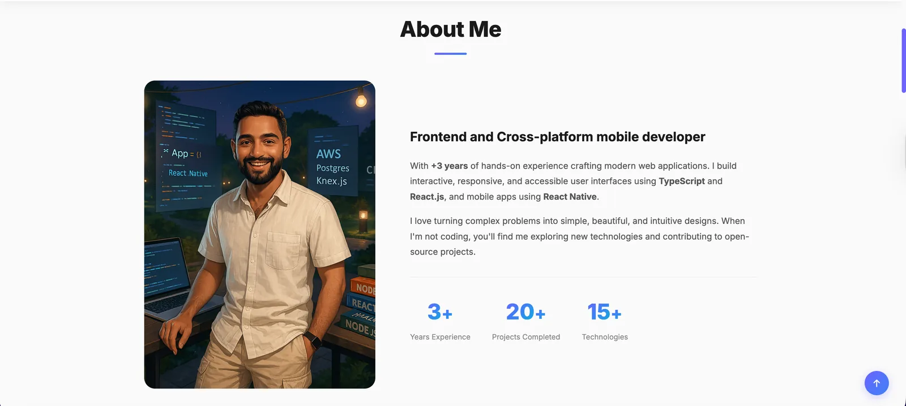

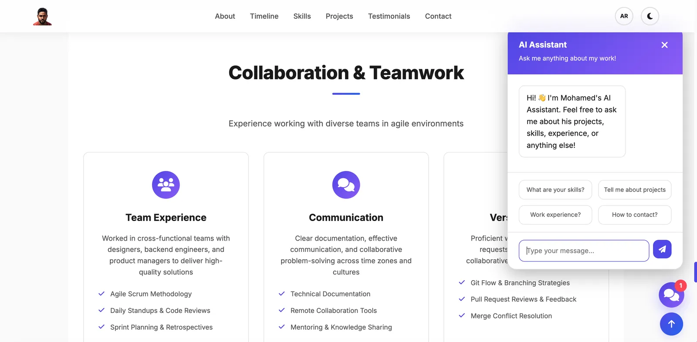

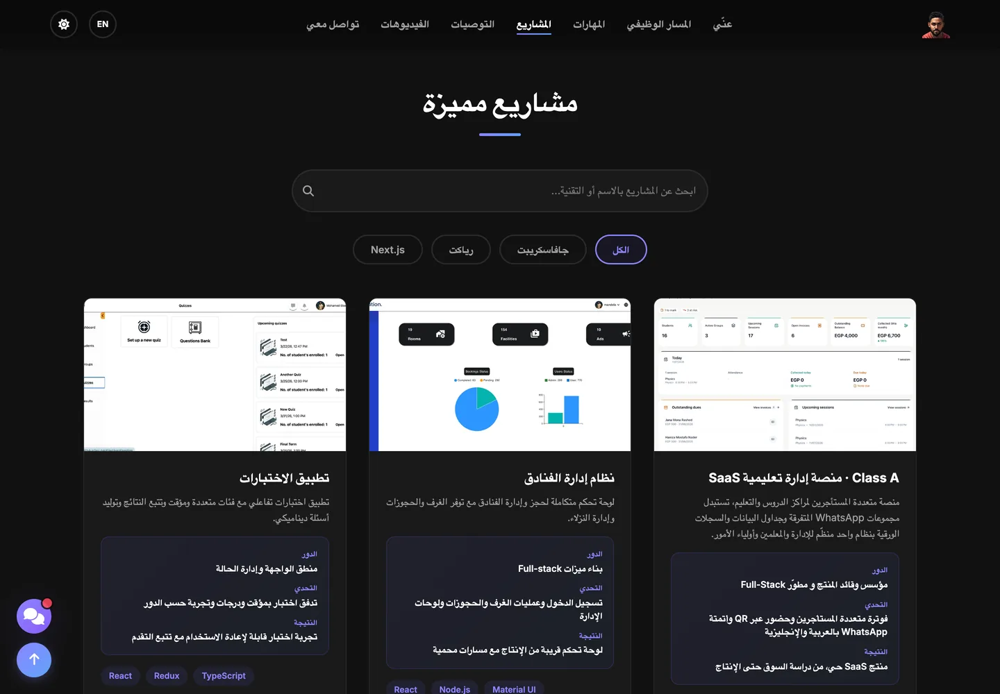

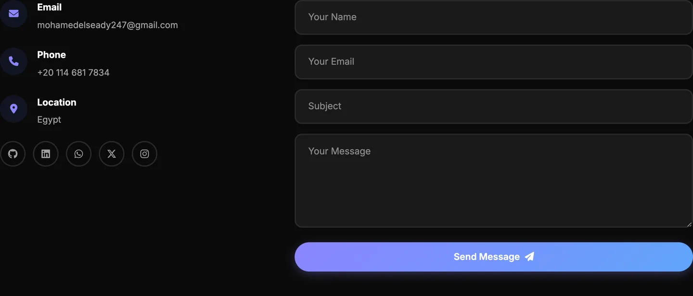

### Mobile

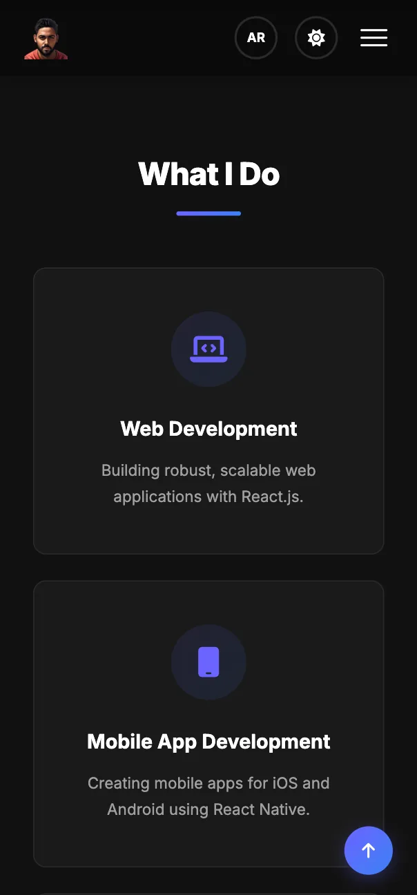

### Class A — featured project

The flagship project on the site: a multi-tenant edTech SaaS built end-to-end, with its own case
study page at [`class-a.html`](class-a.html). Source is private; the live product is at
<https://classaapp.com>.

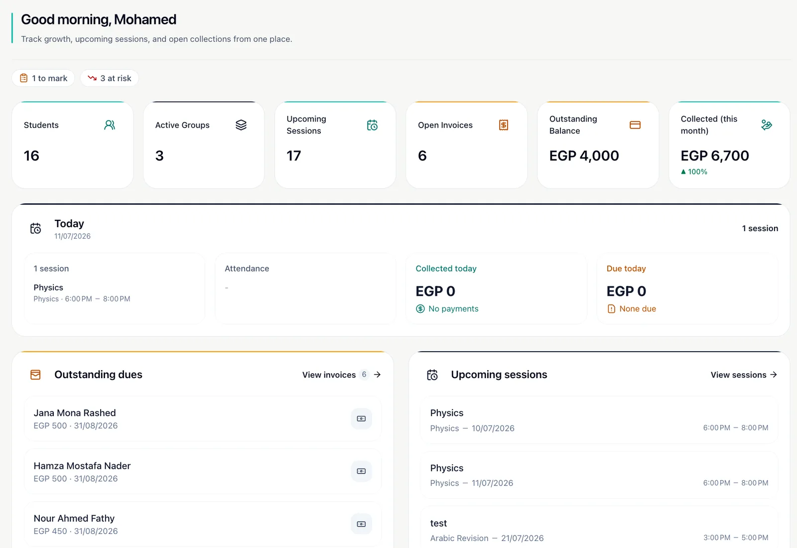

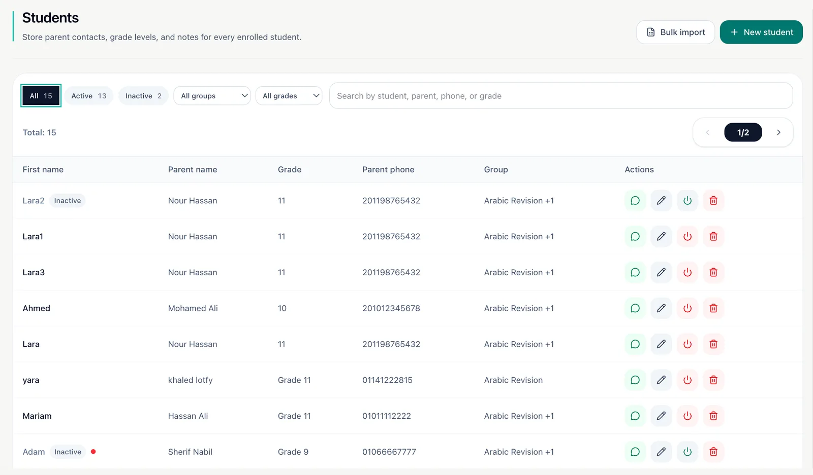

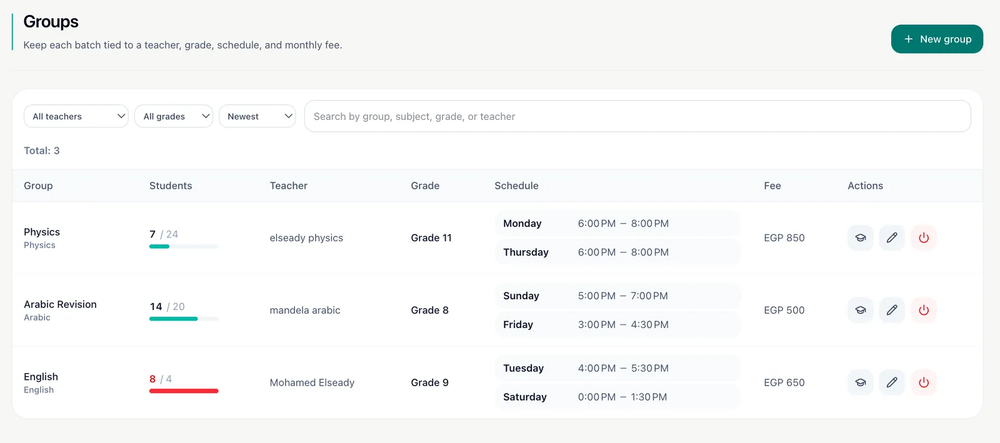

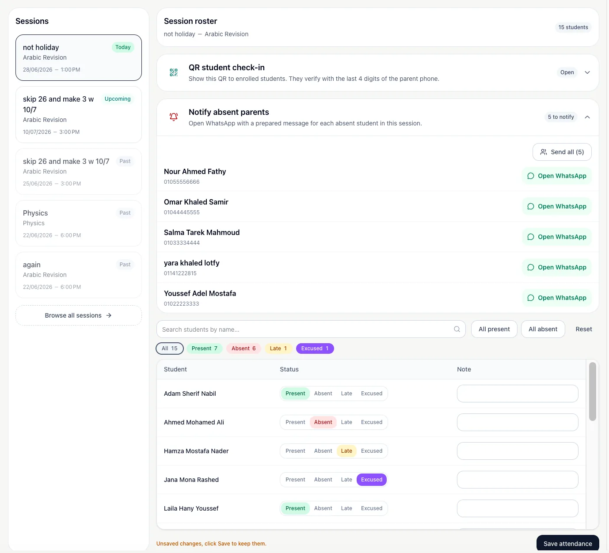

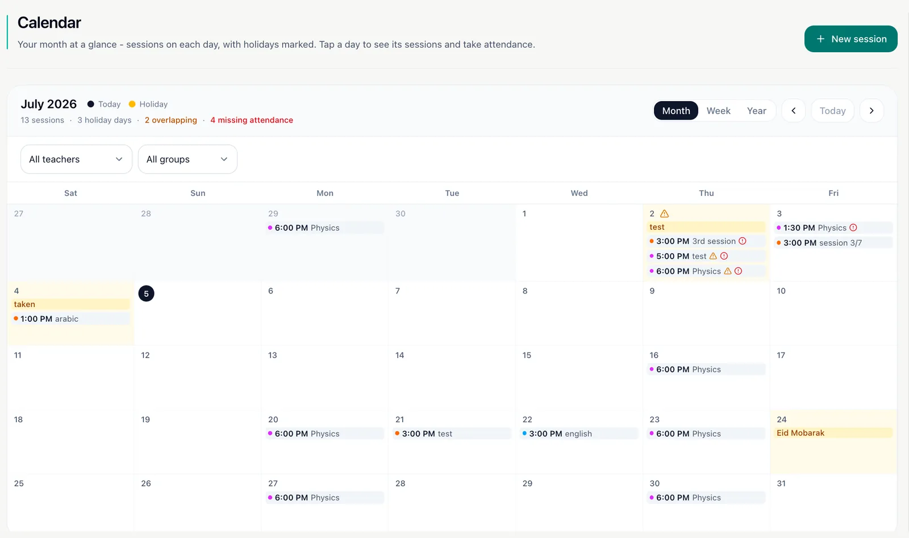

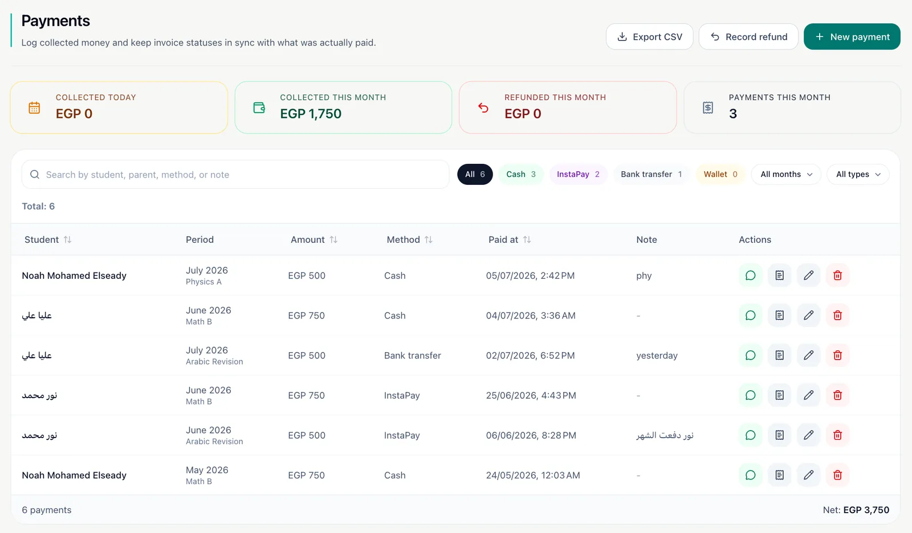

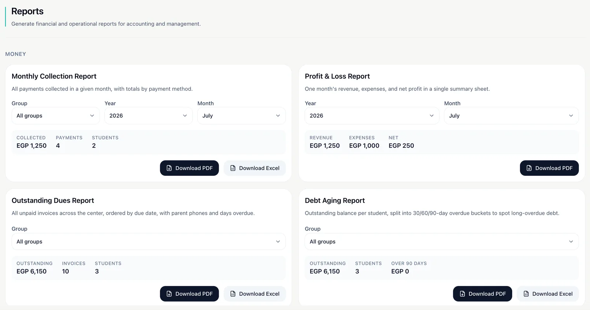

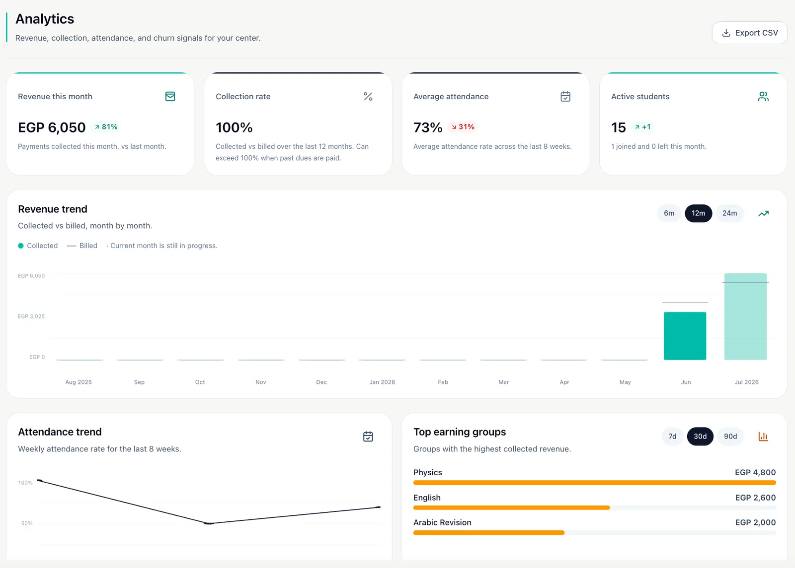

---

## License

© Mohamed El-Seady. All rights reserved.
